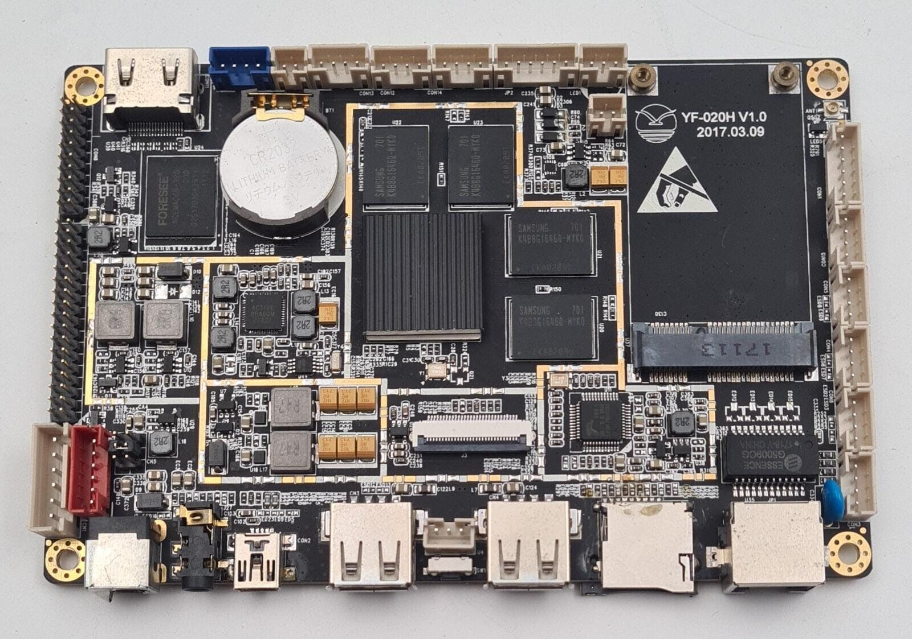
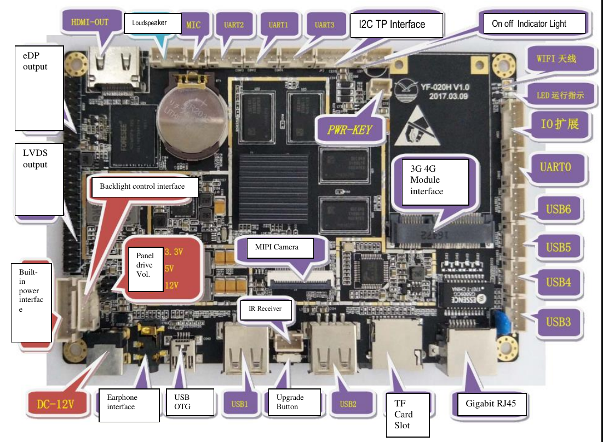

# YF-020H_dev_board
Everything I could gather about the YF-020H development board

This is a rockchip RK3288 develipement board I found in a touchscreen table who was given to me by a friend. 
It is currently running on android 6.0 lollipop

# Technical information about the board
I contacted Maria (maria@cndlcd.com) from CND Electronic Technology (Shenzhen) Co. Ltd. who confirmed me that the board is no more in production but she gave me the some information about the board

  

Figure 1: An exploded view of the Skotobx

