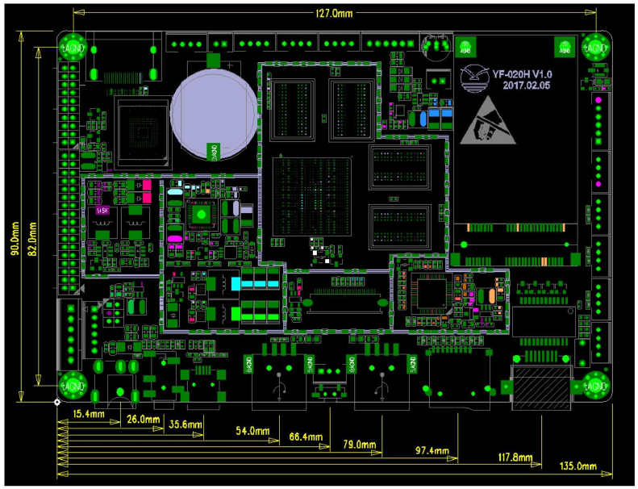

# YF-020H_dev_board
Everything I could gather about the YF-020H development board

This is a rockchip RK3288 develipement board I found in a touchscreen table who was given to me by a friend. 
It is currently running on android 6.0 lollipop

# Technical information about the board
I contacted Maria (maria@cndlcd.com) from CND Electronic Technology (Shenzhen) Co. Ltd. who confirmed me that the board is no more in production but she gave me the some information about the board

Main Hardware Specification
- CPU: RK3288 ,quad-core Cortex-A17+GPU Mail-T764, Up to 1.8G
- RAM: 2G DDR3(up to 4G)
- ROM: EMMC8G/16G/32G(Optional) Standard 16G
- Resolution: 1080P/H.265(4K2K)
- OS: Android 6.0.1 7.0 8.0 Linux
- Display mode: Loop Display, Timing display, Inserting playing etc.
- Network: Gigabit Ethernet, Wifi, Bluetooth 4.1, wireless expending
- USB2.0: 6 USB interface
- Audio Output: 5W (8ohm)Double Sound channel
- Video Output: LVDS EDP Up to 1920*1200
- HDMI: 1 x HDMI 2.0
- RTC: Support
- Watch-dog: Support
- Timing on/off: Support
- OS Updating: SD card and PC
- Others: SD/USB input resolution and starting logo

  

Front side of the board

  

PCB Size and Port Layout

